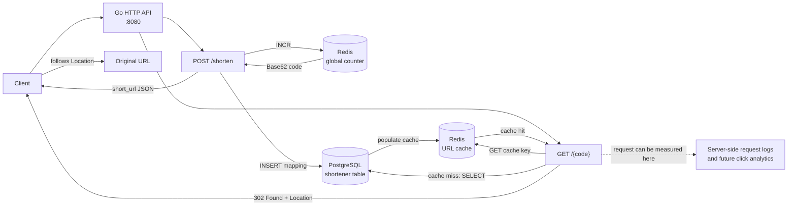

# URL Shortener

A small URL shortener written in Go. PostgreSQL is the source of truth for short-code mappings, while Redis provides a fast lookup cache and a distributed atomic counter for generating unique codes.

## Design

The service has two request paths. Creating a short URL allocates a unique numeric ID in Redis, encodes it with Base62, and persists the mapping in PostgreSQL. Resolving a code reads Redis first and falls back to PostgreSQL on a cache miss.



### Redirect policy

All successful `GET /{code}` responses use **HTTP 302 Found** and set the destination in the `Location` header. A temporary redirect was chosen so the request continues through the shortener service instead of being treated as a permanent URL move by clients and intermediaries. This keeps the redirect path available for server-side logging and future click analysis.

The current implementation logs create and database-fallback events, but it does not yet store click analytics. Adding an analytics event or metrics sink at the redirect handler is the next step if click counts, referrers, user agents, or timestamps are required.

### Resolution behavior

1. `POST /shorten` accepts a JSON payload containing `long_url`.
2. Redis `INCR` allocates a globally unique integer. The initial counter value is `238328`, which gives generated codes a four-character minimum when Base62 encoded.
3. The integer is encoded with Base62 and inserted into PostgreSQL with the original URL.
4. `GET /{code}` checks Redis using `url:code:{code}`.
5. On a cache miss, PostgreSQL is queried and the result is cached without an expiry.
6. The handler returns `302 Found`, or `404 Not Found` when PostgreSQL has no matching code.

## Tech stack

- **Go** 1.27.1
- **PostgreSQL** 16 (via [pgx/v5](https://github.com/jackc/pgx))
- **Redis** 7 (via [go-redis/v9](https://github.com/redis/go-redis))
- **golang-migrate** for schema migrations
- **Testcontainers** for integration tests

## API

| Method | Path | Description |
|--------|------|-------------|
| `POST` | `/shorten` | Create a short URL from a long URL |
| `GET` | `/{code}` | Resolve a code with a 302 redirect |

### POST /shorten

```sh
curl -X POST http://localhost:8080/shorten \
  -H "Content-Type: application/json" \
  -d '{"long_url": "http://pudim.com.br"}'
```

Response:

```json
{"short_url":"http://localhost:8080/100M"}
```

### GET /{code}

```sh
curl -i http://localhost:8080/100M
```

Returns `302 Found` with a `Location` header pointing to the original URL, or `404 Not Found` if the code does not exist. Use `curl -L` when you want curl to follow the redirect to the destination.

## Getting started

### Prerequisites

- Go 1.27+
- Docker and Docker Compose
- [golang-migrate CLI](https://github.com/golang-migrate/migrate/tree/master/cmd/migrate)

### 1. Start dependencies

```sh
docker compose up -d
```

This starts PostgreSQL on port `5432` and Redis on port `6379` with the credentials used by the default application configuration.

### 2. Run migrations

```sh
make migrateup
```

### 3. Run the server

```sh
make run
```

The server listens on `http://localhost:8080`.

## Development

### Run tests

Integration tests start PostgreSQL and Redis with Testcontainers, so Docker must be available. They do not use the containers started by `docker compose`.

```sh
make test
```

### Connect to databases

```sh
make pgcon      # opens psql inside the PostgreSQL container
make rediscon   # opens redis-cli inside the Redis container
```

### Create a migration

```sh
migrate create -ext sql -dir db/migrations -seq <migration_name>
```

### Roll back migrations

```sh
make migratedown
```

## Project structure

```text
.
├── main.go                          # Entry point and HTTP server setup
├── compose.yml                      # Local PostgreSQL and Redis services
├── Makefile                         # Common development commands
├── db/
│   ├── pg.go                        # PostgreSQL connection pool
│   ├── redis.go                     # Redis client and counter initialization
│   └── migrations/
│       ├── 000001_init_schema.up.sql
│       └── 000001_init_schema.down.sql
├── pkg/
│   ├── config/config.go              # Local DSNs and base URL
│   ├── handlers/handlers.go          # HTTP handlers and response contracts
│   └── shortner/
│       ├── create.go                 # ID generation, Base62 encoding, persistence
│       └── retrieve.go               # URL lookup with Redis cache fallback
└── tests/
    ├── integration_test.go           # Create, redirect, and 404 tests
    ├── setup.go                      # Testcontainers and test server setup
    └── testdata/init-user-db.sh      # PostgreSQL test database initialization
```
